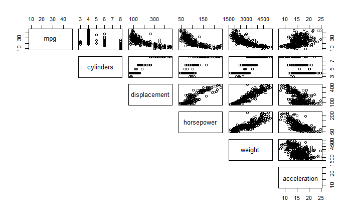
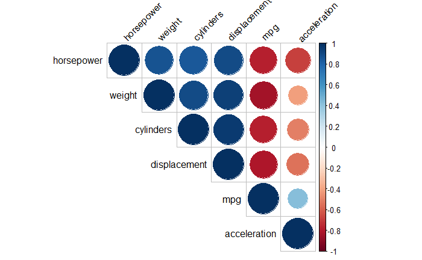

# Exploring the Automobile Dataset in R and linear regression
The goal of this porject is to use the Auto dataset in R to make linear correlations between predictor values and MPG.
We first import the library ISLR which holds the Auto dataset.

## Exploring the data
First the data is explored using summary and variance function to get an overview of the all the variables in the dataset.

## Correlation
Next we look at the plot of all the varaibles against each other:

Also viewing how strong the correlation is between each variable with the help of corrplot library:

## Linear regression

We then observe all the predictor values against the MPG variable, plotting and assigning a linear regression to each:

